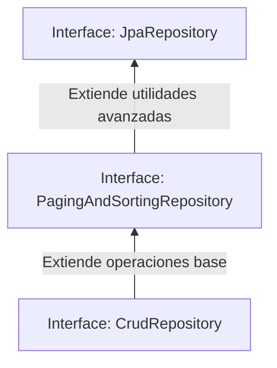

# 🍃 Arquitectura y Core de Spring Framework & Spring Boot

## 🏗️ 1. Evolución del Ecosistema: Spring vs. Spring Boot

### 🍃 Spring Framework
Es un marco de aplicación de **código abierto** (cuyo código fuente puede ser visto, inspeccionado, modificado y mejorado por cualquiera) y un contenedor de Inversión de Control (IoC). Funciona como un motor completo para desarrollar aplicaciones empresariales en Java a través de módulos especializados.

* **El kit incluye:** Inyección de dependencias (`@Autowired`), arquitectura MVC, conectores de datos (JDBC, JPA), seguridad y manejo transaccional.
* **⚠️ El Problema Histórico:** Requiere una **altísima carga de configuración manual** mediante archivos XML o clases JavaConfig complejos.

### 🔥 Spring Boot
Es un complemento que extiende las capacidades de Spring Framework. Su objetivo principal es automatizar la mayoría de las configuraciones repetitivas, permitiendo empaquetar aplicaciones 100% independientes, rápidas de desplegar y fáciles de mantener.

> [!🚀] **El Kit Tecnológico de Spring Boot**
> * **Starters:** Paquetes de dependencias "todo incluido" agrupadas por propósito de negocio.
> * **Auto-configuración Inteligente:** Configura componentes (como la BD) basándose en las librerías del proyecto.
> * **Servidor Embebido:** No requiere compilar archivos `.war` ni instalar servidores externos.
> * **Actuator:** Módulo de monitoreo nativo optimizado para entornos de producción.
> * **Bean Validation:** Validación automática de datos mediante anotaciones en los atributos de las clases.
> * **APIs en 3 líneas:** Abstracción masiva a través de `@RestController` para exponer endpoints inmediatos.

---

## ⚙️ 2. Conceptos Centrales y Arquitectura IoC

### 🔄 Inversión de Control (IoC)
Es un principio de diseño general de software donde **el control de la creación, configuración y ciclo de vida de los objetos se delega a un contenedor**, en lugar de que el programador tenga que instanciarlos manualmente mediante código con la palabra clave `new`.

* **Beneficios:** Reduce drásticamente el acoplamiento entre componentes, elimina el código repetitivo de inicialización y permite reutilizar comportamientos comunes.
* **Implementación:** Spring implementa este principio general a través del mecanismo de **Inyección de Dependencias (DI)** mediante la anotación `@Autowired`.

### 🫘 ¿Qué es un Bean?
Un **Bean** es un objeto de Java que es instanciado, ensamblado, inyectado y **completamente administrado por el contenedor de inversión de control de Spring**. El framework se encarga de todo su ciclo de vida desde el arranque de la aplicación.

---

## 🛠️ 3. Herramientas de Construcción y Arranque

### 📦 Apache Maven
Es una herramienta estándar para la construcción, ciclo de vida y gestión de dependencias en proyectos Java. Su núcleo se centraliza en el archivo **`pom.xml`**, donde se declaran las librerías externas (dependencias), los plugins de compilación y los metadatos del proyecto.
* **Objetivo:** Facilitar, automatizar y estandarizar la organización y compilación del software.

### 🎯 La Anotación `@SpringBootApplication`
Es la anotación central y el **punto de entrada obligatorio** de cualquier aplicación de Spring Boot. Se sitúa encima del método `main` en la clase principal y ejecuta tres acciones automáticas en un solo paso:
1. **`@EnableAutoConfiguration`:** Activa el mecanismo de autoconfiguración inteligente.
2. **`@ComponentScan`:** Escanea el proyecto buscando clases anotadas con `@Component`, `@Service`, `@Repository`, o `@Controller` para registrarlas como Beans.
3. **`@SpringBootConfiguration`:** Permite registrar configuraciones adicionales en el contexto.

### 📦 Spring Boot Starters Comunes
Son dependencias optimizadas de Maven que agrupan todas las librerías necesarias para una tarea sin tener que buscar versiones compatibles manualmente:
* **`spring-boot-starter-web`:** Despliega herramientas para crear servicios RESTful e incluye el servidor embebido.
* **`spring-boot-starter-data-jpa`:** Conector nativo de persistencia de datos mediante JPA e Hibernate.
* **`spring-boot-starter-security`:** Módulo robusto para el control de autenticación, autorización y filtros de seguridad.

---

## 🌐 4. Infraestructura Web y Motores de Servidor

### ⚙️ Mecanismo de Autoconfiguración
Es un sistema inteligente que analiza el *classpath* del proyecto en tiempo de arranque. Si detecta la dependencia de un Starter (por ejemplo, el de base de datos), Spring Boot asume la configuración por defecto del pool de conexiones sin requerir que escribas código de configuración manual.

### 🔌 Servidores Embebidos
Un servidor embebido es un servidor web que **viene empaquetado directamente como una librería dentro del archivo ejecutable de tu aplicación** (tu archivo `.jar`). Esto elimina la necesidad de preinstalar servidores de aplicaciones en el entorno de producción.

#### ⚖️ Tomcat vs. Netty (Motores Internos de Ejecución)

* **Apache Tomcat (Modelo Bloqueante):** Es el servidor que usa **Spring MVC** de forma nativa. Spring Boot lo levanta automáticamente cuando desarrollas un microservicio tradicional síncrono utilizando las anotaciones estándar `@RestController` o consumiendo datos mediante `RestTemplate`.
* **Netty (Modelo Reactivo / No Bloqueante):** Lo usa **Spring WebFlux**, porque es un *starter* distinto, no porque sustituya a Tomcat en el mismo proyecto. Se activa al cambiar a `spring-boot-starter-webflux` y usar `WebClient`. Está altamente optimizado para procesar miles de conexiones asíncronas concurrentes consumiendo una cantidad mínima de hilos del procesador.
* ⚠️ **Aclaración importante en entrevista:** Netty **no reemplaza automáticamente** a Tomcat. Cambiar de motor en un proyecto Spring **MVC** (por ejemplo a Jetty o Undertow) se hace **excluyendo el starter** `spring-boot-starter-tomcat` y agregando el nuevo. Decir que el framework "reemplaza" el servidor es un error.

---

## 📝 5. Configuración Centralizada e Interceptación HTTP

### 📂 Archivos de Propiedades: `.properties` vs. `.yml`
Son los archivos de configuración centralizados (`application.properties` o `application.yml`) utilizados para definir el comportamiento del framework, puertos de escucha, credenciales de bases de datos y variables de entorno.

* **Similitud:** Cumplen exactamente la misma función y la autoconfiguración de Spring Boot los lee por igual al arrancar.
* **Diferencia:** Radica estrictamente en el formato visual y la sintaxis. `.properties` utiliza pares clave-valor planos (`server.port=8080`), mientras que `.yml` emplea una estructura jerárquica basada en sangrías o indentaciones.

### 📥 El Objeto Request HTTP en Spring Boot
📍 *==> Ref: Ejercicios de Spring Boot - Semana 3 (Métodos en Controladores)*

El **Request HTTP** encapsula toda la información y datos que el cliente o frontend envía hacia el microservicio. Se mapea directamente en los parámetros de los controladores y contiene los siguientes componentes estructurales:

| Componente HTTP | Propósito en el Controlador | Ejemplo de Sintaxis / Uso |
| :--- | :--- | :--- |
| **Método HTTP** | Define la acción requerida. | `GET`, `POST`, `PUT`, `DELETE`. |
| **Headers** | Cabeceras de control e identidad. | `Authorization: Bearer <Token_JWT>`. |
| **Query Params** | Filtros opcionales pasados en la URL. | `?nombre=Juan` (Mapeado con `@RequestParam`). |
| **Path Variables** | Variables dinámicas que forman la ruta. | `/usuarios/{id}` (Mapeado con `@PathVariable`). |
| **Body** | El cuerpo de la petición (Payload). | Formato **JSON** o XML (Mapeado con `@RequestBody`). |
| **IP Cliente** | Datos de red de origen. | Metadatos de auditoría de la petición entrante. |

   # 🍃 Comunicación, Controladores y Datos en Spring Boot (Continuación)

## 🔄 6. Serialización, Deserialización y el Motor Jackson

### 🔹 Conceptos Fundamentales
* **Serialización (GET):** Proceso de convertir un objeto de Java a un flujo de bytes o texto. Ocurre cuando el cliente solicita información. Estos datos se transmiten a través de las APIs en formato **JSON** o XML, y también sirven para guardarse en las Bases de Datos.
* **Deserialización (POST/PUT):** El proceso inverso. Toma los bytes o el texto plano (JSON) enviados por el cliente y reconstruye el objeto a sus datos originales de Java para guardarlos o enviarlos a la base de datos.

> [!note] **Importancia y Beneficios del Proceso**
> Funciona como el puente automático, seguro y validado entre la base de datos y las APIs JSON que comunica el Backend con el Frontend.
> * **❌ Negativo:** Sin este mecanismo, tendríamos que mapear y parsear cada campo de forma manual en el código, generando líneas repetitivas y perdiendo mucho tiempo.
> * **✅ Positivo:** Permite validaciones automáticas de tipado, conversión a JSON nativa, menor volumen de código y un desarrollo mucho más rápido.

### ⚙️ El Motor Integrado: Jackson
En Spring Boot, **Jackson** es el motor interno encargado de ejecutar físicamente la serialización y deserialización. 
* **`@RestController`:** Es la anotación clave que le indica a Spring: *"Usa Jackson de manera automática para formatear todas las entradas y salidas de los métodos en esta clase"*.

---

## 🅰️ 7. Objetos Inmutables Nativos de Spring boot

En Spring Boot existen unos cuantos y en Spring Boot otros; para más detalles consulta [[02-Objetos Inmutables en Java y Spring]].

## 🕹️ 8. Controladores en Spring Boot: `@RestController` vs. `@Controller`

Ambas anotaciones definen clases controladoras encargadas de interceptar y manejar peticiones HTTP, pero se diferencian estrictamente en el tipo de respuesta que devuelven al cliente:

* **`@RestController` (Arquitectura de Microservicios):** Diseñado específicamente para la creación de APIs REST. Devuelve los datos directamente en formato JSON o XML al cliente (como Angular). Técnicamente, es la combinación de las anotaciones `@Controller` + `@ResponseBody`.
* **`@Controller` (Desarrollo Monolítico):** Utilizado en la web tradicional donde los servicios y la interfaz residen en el mismo proyecto. En lugar de devolver datos crudos, retorna un archivo HTML o una vista para ser renderizada por el navegador.

---

## 🏎️ 9. Estereotipos
Los **estereotipos** en Spring Boot son un ==conjunto de anotaciones especiales que sirven para **decirle a Spring qué rol o "profesión" tiene una clase** dentro de tu arquitectura.== Para más información y detalles consulta [[02-Estereotipos]].

--- 
## 🛡️ 10. Manejo de Excepciones y Respuestas HTTP

Para gestionar los errores de forma limpia y mantener el control de los flujos del backend, se combinan dos herramientas estratégicas:

* **`ResponseEntity<T>` (Control Puntual):** Es un contenedor que permite configurar con precisión milimétrica la respuesta HTTP (Cuerpo, Cabeceras y Código de Estado) de forma individual en cada uno de los Endpoints de los controladores.
* **`@ControllerAdvice` (Control Global):** Permite crear una clase global e independiente dedicada a interceptar y centralizar los errores comunes de toda la aplicación (como fallas de validación o excepciones inesperadas del sistema) en un solo lugar.

> [!tip] **Estrategia Resumida de Arquitectura**
> Utilizo **`ResponseEntity`** cuando requiero un control preciso y personalizado por cada Endpoint, y delego en **`@ControllerAdvice`** la captura de excepciones globales del sistema para mantener los controladores limpios de bloques `try-catch`. 
>
> **Para mejor entendimiento y detalles revisa en [[02-Manejo de Excepciones en Spring Boot]]**

---

## 🌐 11. Protocolo HTTP y Anatomía de una API

### 🔹 El Protocolo HTTP
Es el protocolo de transferencia de hipertexto que actúa como el lenguaje estándar universal, permitiendo que las APIs y los navegadores web se entiendan entre sí mediante conversaciones síncronas de petición (Verbo/Método) y respuesta.

### 🎯 ¿Qué es una API y un Endpoint?
* **API:** Es un conjunto unificado de Endpoints pertenecientes a un microservicio, diseñados con el fin de ser consumidos de forma remota por un cliente frontend (como Angular) u otros servicios.
* **Endpoint:** Es una URL o ruta específica que representa un recurso disponible. Se accede a ella combinando la dirección de red con un verbo HTTP: `GET` (obtener), `POST` (crear), `PUT` (actualizar) o `DELETE` (eliminar).

### 📊 Códigos de Estado HTTP (Respuestas del Servidor)

| Código HTTP | Significado Técnico | Estado de la Operación |
| :--- | :--- | :--- |
| **`200 OK`** | Todo correcto. | La petición fue exitosa y los datos se procesaron bien. |
| **`201 Created`**| Creado correctamente. | El registro se insertó con éxito en la base de datos. |
| **`404 Not Found`**| No encontrado. | El servidor no pudo localizar el recurso o la URL solicitada. |
| **`500 Internal Error`**| Error del Servidor. | Ocurrió una falla inesperada en la lógica interna del backend. |

---

## 📐 12. Patrón de Diseño: Inyección de Dependencias (DI)

### 🔹 Definición
Es un patrón de diseño de software en el que un componente o clase **no crea de forma manual (con `new`) los objetos o herramientas que necesita para funcionar**. En su lugar, estas dependencias le son suministradas, instanciadas y entregadas desde el exterior por un contenedor de control centralizado (el contenedor IoC de Spring).

```mermaid
graph LR
A[Contenedor IoC de Spring] -->|Inyecta el Bean automáticamente| B[Clase: MiServicio]
C[Dependencia: MiRepository] -.->|Manejado por el framework| A
A -.->|@Autowired| B
```

### 🚀 Ventajas de su Implementación
Consiste en proveer a las clases los recursos externos que requieren (como capas de repositorios o servicios secundarios) listos para usar. Esto aporta los siguientes beneficios estructurales:
* Mantiene el código completamente **limpio** y legible.
* Convierte la arquitectura en un sistema **modular** y desacoplado.
* Incrementa la **flexibilidad** ante cambios de infraestructura.
* Simplifica las tareas de **mantenimiento** a largo plazo.
* Brinda una **mayor estabilidad** general al mitigar errores de inicialización.

 # 🍃 Servicios Web, Arquitectura REST, Servlets y Persistencia en Spring Boot (Continuación)

## 🌐 13. Web Services: Arquitectura SOAP vs. REST

* **Web Service:** Es una forma de comunicación entre aplicaciones o dispositivos a través de la red de manera segura y eficiente. Permite el intercambio de datos usando protocolos y formatos estándar (como HTTP como transporte y XML/JSON como formatos de mensaje), siendo completamente independiente del lenguaje de programación o la plataforma que use cada sistema.
* **SOAP (Simple Object Access Protocol):** Es un protocolo altamente estructurado, rígido, con reglas y estándares muy estrictos que utiliza exclusivamente el formato XML para la comunicación.
* **REST (Representational State Transfer):** Estilo de arquitectura de software que define un conjunto de reglas y directrices para que dos sistemas informáticos se comuniquen a través de HTTP. Aprovecha de manera nativa los métodos HTTP estándar, siendo mucho más fácil, ligero y rápido de implementar que SOAP.

---

## 🏛️ 14. La Teoría de REST: Los 6 Principios de Diseño

La teoría que rige la creación de una arquitectura basada en REST se sostiene sobre 6 principios fundamentales:

> [!💡] **1. Sin Estado (Stateless)**
> Cada petición del cliente al servidor debe ser completamente independiente y contener toda la información necesaria para ser procesada. El servidor **no debe almacenar estados ni sesiones de los usuarios en su memoria**.
> * *Consecuencia:* Si no se cumple y el sistema guarda estados de sesión tradicionales, el servidor se satura y bloquea el acceso de otros usuarios.
> * *Solución Práctica:* Se implementa **JWT (JSON Web Token)** para encapsular la identidad y los permisos en el cliente, permitiendo el acceso masivo y concurrente de usuarios. 
>   * 📍 *==> Ref: AUTHToken - SEMANA 3 - ENUCOM 2*


> [!💡] **2. Cliente-Servidor**
> Separación clara y absoluta de responsabilidades. El frontend se encarga de la interfaz de usuario y el backend de la lógica de negocio y los datos.

> [!💡]  **3. Cacheable**
>  Las respuestas del servidor deben etiquetarse explícitamente como almacenables o no, permitiendo que navegadores, proxies o el propio servidor guarden copias temporales para reducir la carga de red.

> [!💡]  **4. Interfaz Uniforme**
>  Uso estandarizado de identificadores de recursos únicos (URLs claras) y métodos HTTP estándar (`GET`, `POST`, `PUT`, `DELETE`).

> [!💡]  **5. Sistema en Capas**
>  El cliente no sabe si se conecta directamente al servidor final o a un intermediario. Permite estructurar la arquitectura en capas: *Cliente ➔ API Gateway ➔ Servidor de Aplicación ➔ Base de Datos*.

> [!💡]  **6. HATEOAS (Hypermedia As The Engine Of Application State - Opcional)** 
> El JSON devuelto por el servidor incluye dinámicamente enlaces (URLs) que funcionan como un mapa de navegación para que el cliente conozca qué acciones puede realizar a continuación.

> [!💡] ⚖️ Clasificación Práctica de APIs REST
> * **REST API:** Implementa la teoría REST de forma pragmática adoptando la mayoría de los principios. Su principal diferencia es que **no utiliza HATEOAS**, prefiriendo configuraciones más ágiles e inmediatas como las abstracciones de controladores (`ModelViewSet` o `@RestController`).
> * **RESTful API:** Implementa de manera estricta y purista **todos los principios** de la teoría REST, incluyendo obligatoriamente el uso de HATEOAS (lo que se traduce en más líneas de código).

---

## 🔄 15. El Motor de Red: Servlets e Infraestructura Asíncrona

### 🔌 ¿Qué es un Servlet?
El **Servlet** es la interfaz estándar de Java encargada de actuar como puente de comunicación entre el servidor web externo y el código de tu aplicación. 

Se encarga de recibir las rutas HTTP crudas enviadas por un proxy inverso (como Nginx, que redirige el tráfico hacia el puerto del microservicio) y **convertirlas en objetos nativos de Java** (como nombres de APIs o parámetros de métodos).

> [!info] **Analogía de Ejecución: El Flujo del Hotel**
> Imagina un hotel gigante (tu servidor web / Nginx) que cuenta con muchos departamentos u oficinas individuales (tus controladores `@RestController`):
> 1. **Cliente (Angular):** Envía la solicitud: *"Quiero ver la info del cliente con ID 1"*. (`GET /clientes/api/v1/clientes/123/`)
> 2. **Hotel (Nginx):** Detecta la ruta `/clientes/`, sabe que le pertenece al microservicio `clientes_ms:8000` y le dice al personal: *"Atiende esto en el puerto 8001"* transfiriendo la ruta tal cual.
> 3. **Recepcionista (`DispatcherServlet`):** Traduce la petición web a código Java: *¿Buscan la habitación 205? Transfiero la llamada ahí.*
> 4. **Habitación 205 (`@RestController`):** Ejecuta la lógica `ClienteViewSet.retrieve(123)` y responde: *"Aquí tienes los datos de Juan"*.
> 5. **Recepcionista (Servlet):** Toma los datos, los empaqueta en formato **JSON** y se los entrega formalmente al huésped/cliente.

*(Nota: Este enrutamiento interno lo gestiona Spring de forma automática al arrancar la aplicación mediante el comando `mvn spring-boot:run` o levantando el empaquetado ejecutable a través de sus interfaces dinámicas).*

### ⚖️ Servlet 2.5 vs. Servlet 3.0+ (Evolución de Rendimiento)
* **Servlet 2.5 (Modelo Síncrono / Secuencial):** Ejecuta las peticiones una a la vez por cada hilo de ejecución. Es considerablemente más lento ante tráfico masivo. Es comparable a una **camioneta con carga fija**.
* **Servlet 3.0+ Async (Modelo Asíncrono):** Permite liberar el hilo del servidor mientras se procesan tareas pesadas en segundo plano. Es mucho más rápido, capaz de sostener más de 100 peticiones simultáneas de forma eficiente (ideal para sistemas de chats o streaming). Es comparable a un **tráiler de alta capacidad**.

---

## 🗄️ 16. Persistencia de Datos: ORM con JPA e Hibernate

> [!abstract] Resumen Rápido
> No son lo mismo. **ORM** es la técnica teórica, **JPA** es la interfaz estándar (las reglas del juego) e **Hibernate** es la herramienta real (la que ejecuta el código). Trabajan juntos como un equipo para que no tengas que escribir código SQL a mano.

---

### 1. 🔹 ¿Qué es un ORM (Object-Relational Mapping)?
No es una herramienta, es una **técnica de programación (un concepto)**. 
- **¿Para qué sirve?** Sirve para solucionar un problema llamado *"desajuste de impedancia"*: las Bases de Datos Relacionales entienden de tablas, filas y columnas, pero Java entiende de Clases, Objetos y Atributos.
- **¿Por qué se usa?** El ORM es el "puente virtual" que traduce automáticamente el mundo de los objetos de Java al mundo de las tablas de SQL. 

---

### 2. 🔹 ¿Qué es JPA (Jakarta Persistence API)?
JPA es una **especificación (un estándar o un manual de reglas)** de Java.
- **¿Para qué sirve?** Define las anotaciones oficiales (como `@Entity`, `@Table`, `@Id`) y los métodos que todos los frameworks de persistencia en Java deben respetar.
- **🚨 Nota técnica importante:** JPA **no tiene código ejecutable**. Es solo una interfaz (un plano arquitectónico). Si intentas usar JPA solo, no pasará nada porque no sabe cómo conectarse a una base de datos. Necesita obligatoriamente a alguien que la implemente.

```java
@Entity // Proviene de JPA: Indica que esta clase representa un modelo de datos
@Table(name = "tabla_usuarios") // Proviene de JPA: Vincula la clase con la tabla física
public class Usuario {
    @Id // Proviene de JPA: Define la llave primaria
    private Long id;
}
```

---

### 3. 🔹 ¿Qué es Hibernate?
Hibernate es el **Proveedor de Persistencia (La Implementación Real)**.
- **¿Para qué sirve?** Es el motor real. Hibernate toma el manual de reglas de JPA y escribe todo el código en Java necesario para abrir conexiones a la base de datos, leer tus entidades y escribir las sentencias SQL reales (`SELECT`, `INSERT`, `UPDATE`).
- **¿Por qué se usa?** Porque es el framework que le da vida a JPA. Cuando usas Spring Boot, cuando haces un `repository.save()`, tras bambalinas es Hibernate quien está traduciendo ese objeto a SQL y enviándolo por la red.

---

> [!abstract] Resumen Rápido
> - **El ORM** es el concepto o la técnica (la filosofía de mapear objetos a tablas).
> - **Hibernate es el ORM real**, es decir, el software/motor que hace la magia de traducir tus objetos a código SQL y viceversa.
> - **JPA son las reglas** (las anotaciones como `@Entity`, `@Table`, `@Id`) que tú defines en tus clases para que Hibernate sepa exactamente qué reglas seguir y cómo hacer el mapeo.

---
### 🏎️ La Analogía Definitiva para no confundirse jamás

Imagina que quieres competir en la Fórmula 1:
1. **El ORM** es el concepto de *"carreras de autos"*. Es la idea abstracta de competir en una pista con un vehículo de cuatro ruedas.
2. **JPA** es el **Reglamento de la FIA (Federación Internacional)**. Es un libro que dice: *"El auto debe medir tanto, debe usar estas llantas y el motor debe tener estas reglas"*. El libro no corre, solo da las órdenes.
3. **Hibernate** es el **Auto de Red Bull o Ferrari**. Es la máquina real construida siguiendo las reglas del libro de JPA. Es el que ruge, consume gasolina y corre en la pista real (la Base de Datos).

---

### 🚀 Configuración y Automatización en Spring Boot

Gracias a que Spring Boot incluye a Hibernate por debajo, el sistema puede sincronizar tus clases con la base de datos en automático al arrancar. Esto se activa en el archivo de propiedades agregando:

```properties
spring.jpa.hibernate.ddl-auto=update
```
- **¿Cómo funciona la magia?** Al arrancar, **Hibernate** (siguiendo las reglas de **JPA**) escanea tus clases `@Entity`, viaja a tu base de datos física, compara las columnas y ejecuta de forma automática los comandos `ALTER TABLE` necesarios para actualizar las columnas o restricciones que hayas modificado en Java.

> [!warning] **Peligro en Producción**
> El modo `update` es excelente para desarrollo y pruebas (como lo usaste con H2), pero en producción está **estrictamente prohibido**, ya que un error en tu código de Java podría borrar o alterar columnas con datos reales de clientes.
> * ⚠️ En producción la opción correcta es **`validate`**, que comprueba que el esquema de la base de datos coincide con tus clases `@Entity` y **falla al arrancar** si no coincide, sin modificar nada.
> * ⚠️ Evita también `none`: no valida nada, simplemente le dice a Hibernate que no haga absolutely nada y deja que el error aflore más tarde y en un lugar más difícil de depurar.
> * La práctica profesional es `validate` combinado con **migraciones controladas** (Flyway o Liquibase), que son las que ejecutan los `ALTER TABLE` de forma versionada y auditable.


> [!tip] **INMUTABILIDAD**
> Es uno de los pilares más **importantes** en el desarrollo de software. Encontrarás más detalles de mi experiencia trabajando en un miniproyecto mío; las notas son [[02-Inmutabilidad]]
>
---

## 🎛️ 17. Capa de Datos: `CrudRepository` vs. `JpaRepository`

Spring Data JPA nos provee de interfaces preconstruidas para interactuar con la base de datos. La elección entre ellas depende de la complejidad de operaciones que requiera el módulo:



### 🔹 `CrudRepository`
Es la interfaz más básica y simple. Está orientada exclusivamente a proveer las operaciones CRUD esenciales sobre una entidad de la base de datos:
* **`save()`** ➔ Inserta o actualiza un registro.
* **`findById()`** ➔ Busca un registro específico por su clave primaria.
* **`findAll()`** ➔ Devuelve todos los registros.
* **`count()`** y **`existsById()`** ➔ Consultan cuántos hay y si existe uno con cierta clave.
* **`deleteById()`** y **`deleteAll()`** ➔ Eliminan un registro por su ID o toda la tabla.
* **`saveAll()`** ➔ Guarda una colección de registros en una sola llamada.

### 🔹 `JpaRepository`
Es una interfaz avanzada que extiende directamente a `CrudRepository` y a `PagingAndSortingRepository`. Además de heredar todos los métodos CRUD básicos, añade características específicas del ecosistema de persistencia de JPA:
* Soporte nativo para **Paginación** de registros masivos.
* Herramientas de **Ordenación** dinámicas (`Sort`).
* Métodos avanzados de persistencia como el vaciado de transacciones a disco (`flush`) o la eliminación masiva por lotes (`deleteInBatch`).

### 📌 Resumen de Elección Técnica
* Utiliza **`CrudRepository`** cuando requieras un repositorio ligero, simple y que solo deba cumplir con transacciones básicas de lectura y escritura.
* Selecciona **`JpaRepository`** cuando trabajes con bases de datos relacionales complejas que requieran optimizaciones de rendimiento en las consultas, ordenamientos o paginados del lado del servidor.

---

## 🏛️ 18. Arquitectura MVC y Patrones de Relación en Bases de Datos

### 🔹 La Arquitectura MVC (Modelo-Vista-Controlador)
Es un patrón de arquitectura de software que divide las responsabilidades del sistema en tres capas independientes:
* **Modelo:** Capa encargada exclusivamente de la comunicación, mapeo y persistencia con la base de datos.
* **Controlador:** El componente intermedio que intercepta las peticiones del cliente, procesa los datos y coordina el flujo.
* **Vista:** La interfaz gráfica de usuario en donde se plasma y muestra la información visualizada.

### 🔌 Patrones de Despliegue: Monolitos vs. Microservicios

| Característica | Arquitectura Monolítica | Arquitectura de Microservicios |
| :--- | :--- | :--- |
| **Estructura** | Todos los servicios conviven dentro de un solo sistema unificado. | Cada funcionalidad del sistema vive y opera en un servicio independiente. |
| **Base de Datos** | Típicamente usa una base de datos compartida basada en **llaves foráneas** estrictas. | Cada microservicio posee su propia base de datos (pueden usar gestores distintos). **No existen llaves foráneas**. |
| **Relaciones** | Integridad referencial directa mediante SQL nativo. | Consumo mutuo entre microservicios mediante **protocolos HTTP y URLs** para comparar datos. |

### 🛠️ Mecanismos en Spring Boot para Consumir APIs Externas / Microservicios
Cuando un servicio necesita solicitar información a otro, el framework ofrece dos herramientas de conectividad:
1. **`@FeignClient`:** Permite declarar una interfaz pura de Java y decorarla con la anotación `@FeignClient`. Mágicamente, Spring Boot la convierte en un cliente HTTP en tiempo de ejecución. Es una solución limpia para microservicios, inyectándose de forma directa en la capa de `Service`.
2. **`RestTemplate`:** Requiere registrar e inyectar un Bean de tipo `RestTemplate` en la capa de negocio. La construcción de las peticiones, cabeceras y payloads se gestiona manualmente, brindando un control absoluto sobre el flujo de red.

---

## 🔒 19. Seguridad en APIs y Microservicios

### 🛡️ Estrategia de Protección General en Spring
"Para proteger mis microservicios, configuro **Spring Security** como la capa principal de control de acceso, acoplada a una política de **CORS Origin** y el estándar **JWT (JSON Web Tokens)** para administrar la autenticación y la autorización por roles."

* **CORS Origin (Cross-Origin Resource Sharing):** Mecanismo de seguridad nativo de los navegadores que restringe el acceso a recursos entre diferentes orígenes. Se configura en el backend para permitir que un frontend (como Angular corriendo en su propio dominio) consuma los endpoints de la API de forma segura.

### 🔑 El Estándar JWT (JSON Web Token)
Es el estándar por excelencia para la autenticación **Stateless** (sin estado). Genera un token firmado criptográficamente tras el inicio de sesión exitoso, el cual viaja en cada petición HTTP posterior para verificar la identidad del cliente.
* *Caso Real:* "En *Textiles* lo implementé para blindar los endpoints del backend y restringir el acceso a los módulos de inventario únicamente a usuarios autenticados."

> [!🔥] **Ventajas de JWT en Microservicios**
> * ✅ **STATELESS:** No consume memoria ni tablas de sesión en la base de datos del servidor.
> * ✅ **ESCALABLE:** Capaz de operar sobre arquitecturas distribuidas de más de 1000 servidores sin conflictos.
> * ✅ **RÁPIDO:** El servidor valida el acceso verificando la firma criptográfica, eliminando consultas recurrentes a la BD.
> * ✅ **SEGURO:** Datos protegidos por firma criptográfica con tiempos de expiración definidos.
> * ✅ **ROLES:** Permite inyectar permisos y roles del usuario mediante *claims* (ej. `admin`, `vet`, `cliente`).
> * ✅ **REFRESH:** Soporte de tokens de larga duración para automatizar el re-login del usuario de forma invisible.

### 🌐 Métodos Alternativos de Seguridad y Autenticación
1. **Token Authentication:** El servidor genera un token aleatorio único por usuario y lo almacena físicamente en la BD para contrastarlo en cada petición.
2. **Basic Authentication:** Comparación directa de las credenciales (Usuario/Contraseña) enviadas en texto plano codificado dentro del header. **Es altamente inseguro**.
3. **Session Authentication:** El servidor crea un registro de sesión tradicional en la base de datos. Es un método rígido que solo funciona de manera óptima en navegadores web, quedando **descartado para APIs móviles**.
4. **OAuth2:** Protocolo avanzado que genera un token seguro y delega la validación de la identidad a proveedores externos. Es el flujo común utilizado al iniciar sesión mediante redes sociales.

---

## 🌐 20. Anatomía de la Red: HTTP, Headers y Documentación

### 📦 Estructura de Bloques de una Petición HTTP
El **Header** actúa como el contenedor de metadatos de la petición HTTP. Cada conversación de red disparada desde el cliente se divide estrictamente en 3 bloques de información:

```text
1. LÍNEA DE ESTADO ➔ GET /api/usuarios HTTP/1.1
2. HEADERS (Cabeceras) ➔ Contenedor de metadatos de control
3. BODY (Cuerpo/Payload) ➔ JSON o datos crudos de la transacción
```

#### 🛠️ Componentes Comunes dentro del bloque HEADERS:
* **`Host:`** Indica la dirección y puerto de destino (`localhost:8080`).
* **`Content-Type:`** Declara el formato del contenido que viaja en el cuerpo (`application/json`).
* **`Authorization:`** Transporta las credenciales de seguridad. Aquí se inyecta el **Bearer Token**.
  * *¿Qué es el Bearer Token?* Es el JWT que se envía dentro de esta cabecera. Indica al servidor que quien posea y presente ese token firmado tiene autorización explícita para acceder a la API protegida.

### 📋 Gestión de Documentación de APIs
Para la creación, exposición y lectura de la documentación técnica de las APIs se emplea el estándar de **OpenAPI** automatizado mediante **Swagger**.
* **Flujo de lectura:** El proceso correcto para consumir una API documentada consiste en revisar primero el listado de **endpoints + métodos HTTP disponibles**, y posteriormente analizar el contenedor de la petición (formatos esperados en Swagger o Postman) para estructurar el cliente.

---

## 📡 21. Integraciones Externas, Pruebas y Frontend

### 💳 Consumo de APIs Externas y Manejo de Errores de Integración
* *Caso Real:* "He consumido APIs de terceros como **Mercado Pago** para la pasarela de pagos integrando el módulo de transacciones en el proyecto de *Refacciones Automotrices (Polihules)*."
* **Estrategia ante Errores de Integración:** Cuando el sistema llama a servicios externos (Mercado Pago, OpenAI, Salesforce) y estos fallan, la comunicación se blinda con dos mecanismos distintos, y es clave no confundirlos en entrevista:
    * **Errores de transporte** (el tercero está caído, hay *timeout*, falla el DNS): se capturan en bloques `try-catch`, porque sí se lanzan excepciones como `ResourceAccessException` o `SocketTimeoutException`.
    * **Errores de negocio o de estado** (un `404`, un `422`, un `500`): **no son excepciones**, son respuestas HTTP válidas. Se detectan **leyendo la respuesta** (por ejemplo con `ResponseEntity` o el `status` del `RestTemplate`) y se maneja con lógica condicional o con `@ControllerAdvice`.

### 🧪 Pruebas Unitarias (Testing)
"En mis proyectos con Spring Boot incorporo el paquete **`spring-boot-starter-test`**, el cual incluye de forma nativa **JUnit 5 y Mockito**. El objetivo central es evaluar la lógica de negocio de manera aislada, simulando (*mockeando*) los repositorios para asegurar pruebas rápidas, independientes y 100% confiables sin tocar la base de datos real." 
- Para más información de cómo implementar *LOS TESTS EN SPRING BOOT* revisa [[TEST]]. 

### 🅰️ Manejo de Tokens y Sesiones en el Frontend (Angular)
Para persistir los datos de sesión del usuario tras un login exitoso en Angular, se utilizan los mecanismos de almacenamiento del navegador:
* **`sessionStorage`:** Mantiene la información activa únicamente mientras la pestaña o sesión del navegador permanezca abierta.
* **`localStorage`:** Almacenamiento persistente que no se borra al cerrar el navegador.
  * *Guardar Token:* `localStorage.setItem('token', jwt)`
  * *Recuperar Token:* `localStorage.getItem('token')`

> [!warning] **Seguridad Avanzada: Cookies HttpOnly**
> Son un tipo de cookies especiales configuradas desde el backend que tienen activada la bandera `HttpOnly`. Esto garantiza que los datos **sean completamente inaccesibles para los scripts del lado del cliente (JavaScript/TypeScript)**, bloqueando de raíz vulnerabilidades de robo de tokens mediante ataques tipo XSS (Cross-Site Scripting).

---

## 👔 22. Casos de Éxito en Producción, Java Beans y Anotaciones

### 🎭 Experiencia en Soporte y Metodologías Ágiles

### ¿Cuál es tu experiencia en Lambdas e interfases funcionales?
*"En mi experiencia con Spring Boot, utilizo las expresiones lambda y las interfaces funcionales a diario para escribir un código más limpio, declarativo y expresivo. *

_Principalmente las aplico en la **capa de servicios** junto con la **API de Streams** de Java para filtrar, transformar y agrupar colecciones de datos o entidades antes de enviarlas al controlador._

#### ¿Has trabajado con metodologías ágiles?
"Sí. En *Polihules* adoptamos **Extreme Programming (XP)**, una metodología que prioriza las entregas frecuentes de software funcional, la integración continua y una comunicación constante y transparente con el cliente. En *Textiles* trabajamos bajo un enfoque iterativo enfocado al impacto del negocio. Poseo total adaptabilidad para incorporarme a dinámicas de **Scrum**, que es el estándar habitual en organizaciones de gran escala."

#### ¿Has dado soporte a sistemas en producción?
"Sí, en *Polihules* apoyé directamente en la **mitigación y corrección de bugs críticos reportados en tiempo real por los usuarios durante temporadas de alto tráfico**. Esta responsabilidad me enseñó a navegar de forma eficiente por los archivos de logs en producción, aislar y reproducir errores en entornos controlados y priorizar las soluciones basándome en el nivel de impacto operativo del negocio."

### ☕ Componentes Core de Java: Java Beans y Anotaciones
* **Anotaciones:** Etiquetas especiales (`@Component`, `@Service`, etc.) que se colocan encima de clases, métodos o atributos para indicarle al framework de Spring cómo debe autoconfigurarse, comportarse o procesar dicho elemento en tiempo de ejecución, sin alterar el código fuente de Java.
* **Java Bean:** Clases estándar de Java (POJOs) que estructuran componentes reutilizables y limpios bajo **4 reglas obligatorias** más una opcional:

```text
✅ 1. La clase debe estar declarada como pública (public class).
✅ 2. Debe poseer un constructor público que no reciba parámetros (Constructor vacío).  
✅ 3. Todos sus atributos de datos deben ser estrictamente privados (private).  
✅ 4. Debe exponer el acceso a sus campos mediante Getters y Setters públicos.  
✅ 5. (Opcional) Debe implementar la interfaz estándar de 'Serializable'.
```
