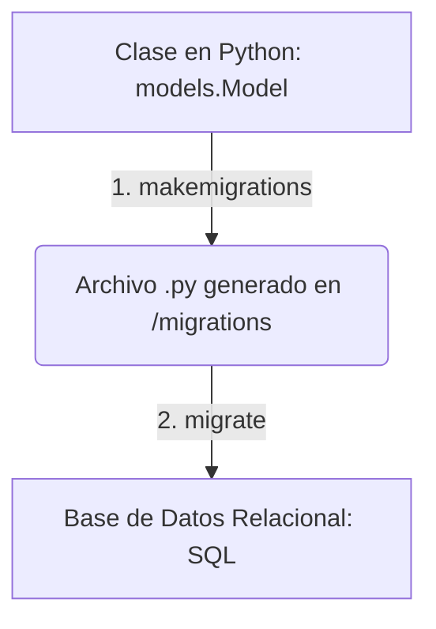

# 🐍 Guía de Comandos y Configuración de Entorno en Django & DRF

## 💻 1. Inicialización del Entorno Virtual

Antes de instalar dependencias, es fundamental aislar el entorno de desarrollo para evitar conflictos entre versiones de librerías en tu sistema.

```bash
# 1. Crear la carpeta del proyecto y acceder a ella
mkdir mi_proyecto && cd mi_proyecto

# 2. Crear el entorno virtual (venv)
py -m venv venv

# 3. Activar el entorno virtual (En Windows)
venv\Scripts\activate
```

---

## 📦 2. Gestión de Dependencias e Instalaciones (`pip`)

Con el entorno virtual **activado**, ejecuta las siguientes instalaciones según las necesidades de tu arquitectura (Base de datos, Seguridad, APIs o Testing):

```bash
# Framework Core e Inserción de Datos
pip install python                     # Asegura la base del intérprete en el entorno
pip install django                     # Framework web principal
pip install djangorestframework        # Herramientas para la creación de APIs REST (DRF)

# Motores de Base de Datos y Multimedia
pip install mysqlclient                # Driver nativo de conexión exclusivo para MySQL
pip install Pillow                     # Librería para procesamiento y lectura de archivos de imagen

# Seguridad, Conectividad y Variables de Entorno
pip install django-cors-headers        # Gestión de CORS para permitir peticiones HTTP desde el Frontend (Angular)
pip install djangorestframework-simplejwt # Soporte nativo para autenticación Stateless mediante tokens JWT
pip install python-dotenv              # Carga y gestión segura de variables de entorno (.env) en producción

# Interfaz y Formularios Monolíticos
pip install django-widget-tweaks       # Facilita el estilizado de formularios Django con Bootstrap directamente en los templates

# Herramientas de Testing y Automatización
pip install requests                   # Librería para hacer peticiones HTTP (Usada por Test Sprite para simular llamadas al servidor)
pip install beautifulsoup4             # Parser de HTML (Usada en Testing para analizar respuestas visuales como Test Sprite)
```

> [!🚀] **Producción y Despliegue**
> * **Congelar dependencias:** Reúne y empaqueta de forma automática todas las librerías instaladas en tu entorno junto con sus versiones exactas. Esto garantiza que cualquier compañero o servidor de producción pueda replicar tu ecosistema.
>   ```bash
>   pip freeze > requirements.txt
>   ```
> * **Instalar desde un archivo:** Instala masivamente todas las dependencias listadas en un proyecto existente.
>   ```bash
>   pip install -r requirements.txt
>   ```

---

## 🛠️ 3. Creación de la Estructura del Proyecto

* **Crear el Proyecto de Django:** Inicializa el núcleo del sistema. El uso del punto (`.`) al final es una buena práctica para indicarle al comando que use el directorio actual como raíz del proyecto, evitando carpetas anidadas innecesarias.
  ```bash
  django-admin startproject nombre_proyecto .
  ```
* **Crear una Aplicación Intermediaria:** Genera un módulo o aplicación aislada dentro del proyecto (por ejemplo, para centralizar tus endpoints).
  ```bash
  py manage.py startapp api
  ```

---

## 🗄️ 4. Flujo del ORM y Ciclo de Base de Datos

> [!IMPORTANT] **Regla de Oro en Cambios de Modelos**
> Cada vez que crees, modifiques o elimines un atributo en tus clases (`models.Model`), debes ejecutar el flujo de comandos del ORM en estricto orden para no corromper la base de datos.



1. **Generar la Migración:** Traduce tus clases y modelos de Python a planos estructurados intermedios en formato SQL.
   ```bash
   py manage.py makemigrations
   ```
2. **Aplicar la Migración:** Ejecuta los planos generados impactando de forma directa y permanente las tablas físicas dentro de tu base de datos.
   ```bash
   py manage.py migrate
   ```
   *(Nota: Asegúrate de escribir `migrate` de forma correcta en la terminal).*

---

## 🚀 5. Servidor de Desarrollo Local

* **Desplegar de forma Local:** Levanta el servidor integrado de Django para desarrollo en tu máquina.
  ```bash
  py manage.py runserver
  ```
  * *💡 Tip:* Por defecto, tu API o Monolito estará disponible en la dirección de red local `http://127.0.0`. Puedes cancelar el proceso en cualquier momento presionando `CTRL + C` en tu terminal.
