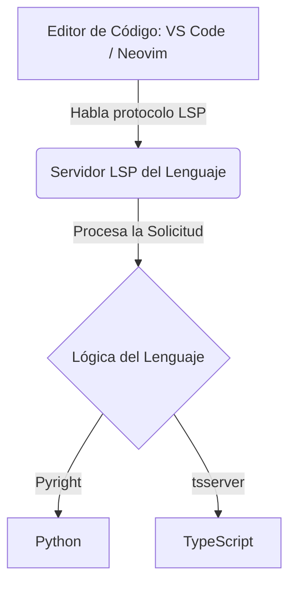

# 🤖 Conceptos Tecnológicos: LLMs y LSP

## 🧠 1. LLM (Large Language Model - Modelo de Lenguaje Grande)

### 🔹 Definición
Modelos de inteligencia artificial avanzados basados en **redes neuronales** y entrenados con volúmenes masivos de datos textuales.

| Componente | Detalle |
| :--- | :--- |
| **⚙️ Función** | Comprender, resumir, traducir, predecir y generar texto en lenguaje humano natural. |
| **🚀 Casos de Uso** | Chatbots conversacionales, creación de contenido, resúmenes automáticos, asistencia en programación y traducción automática. |
| **💡 Ejemplos** | GPT-4 (OpenAI), Claude (Anthropic), Llama (Meta), Falcon. |

> [!WARNING] **Características y Limitaciones**
> Aunque son altamente capaces de aprender patrones semánticos complejos, tienen restricciones críticas:
> * **Alucinaciones:** Tendencia a generar información falsa o inventada con apariencia de verdad.
> * **Sesgos:** Reflejo de prejuicios o datos no neutrales presentes en la información con la que fueron entrenados.

---

## 💻 2. LSP (Language Server Protocol - Protocolo de Servidor de Lenguaje)

### 🔹 Definición
Estándar técnico de comunicación desarrollado por Microsoft que actúa como un **intermediario unificado** entre los editores de código y las herramientas de análisis de lenguajes.

> [!NOTE] **El Problema que Resuelve (M vs N)**
> Antes del LSP, si tenías 4 editores y 4 lenguajes, se debían programar 16 extensiones diferentes. Con LSP, cada editor solo implementa el cliente una vez, y cada lenguaje desarrolla su servidor de forma independiente.

* **🎯 Función Principal:** Proporcionar características de inteligencia de código de manera uniforme a cualquier IDE o editor compatible.
* **⚡ Capacidades en Tiempo Real:** Permite autocompletado avanzado (IntelliSense), "Ir a la definición" (`Go to Definition`), búsqueda global de referencias y refactorizaciones seguras.
* **🛠️ Ejemplos de Servidores:** `Pyright` / `Pylance` (Python), `tsserver` (TypeScript/JavaScript), `gopls` (Go).
